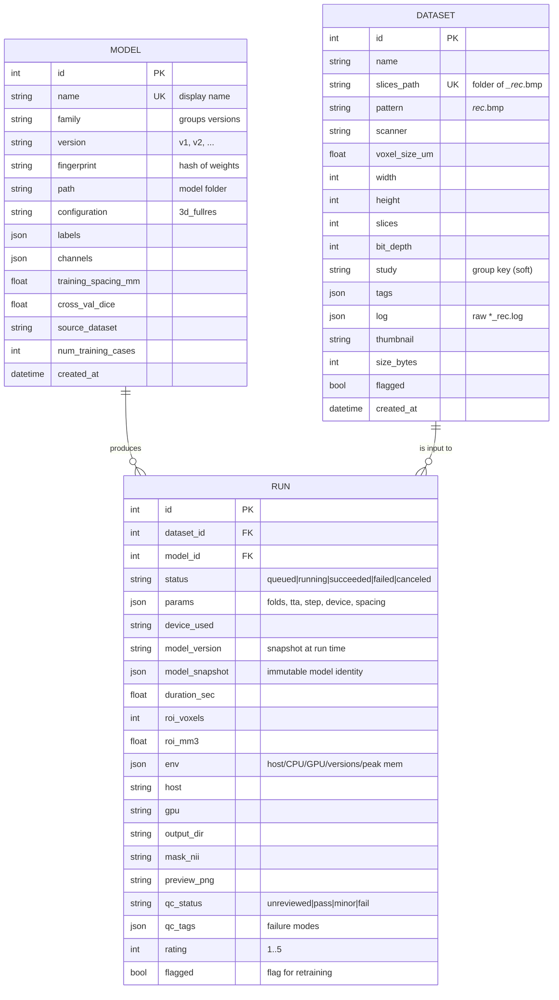
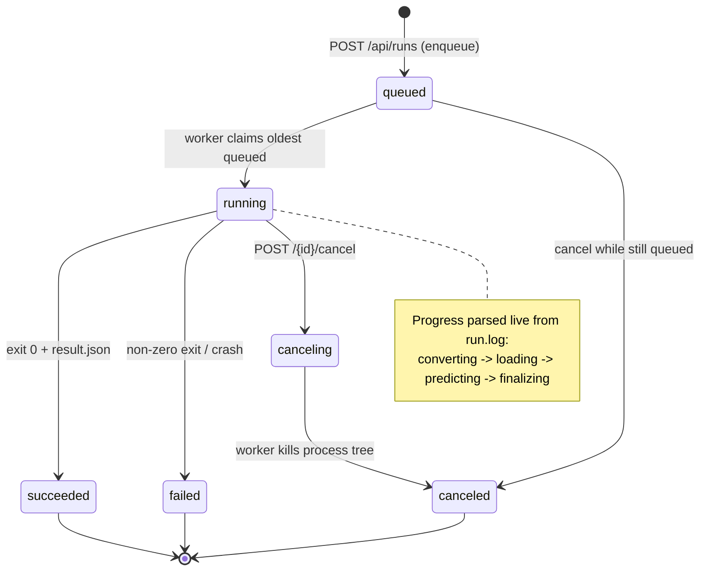
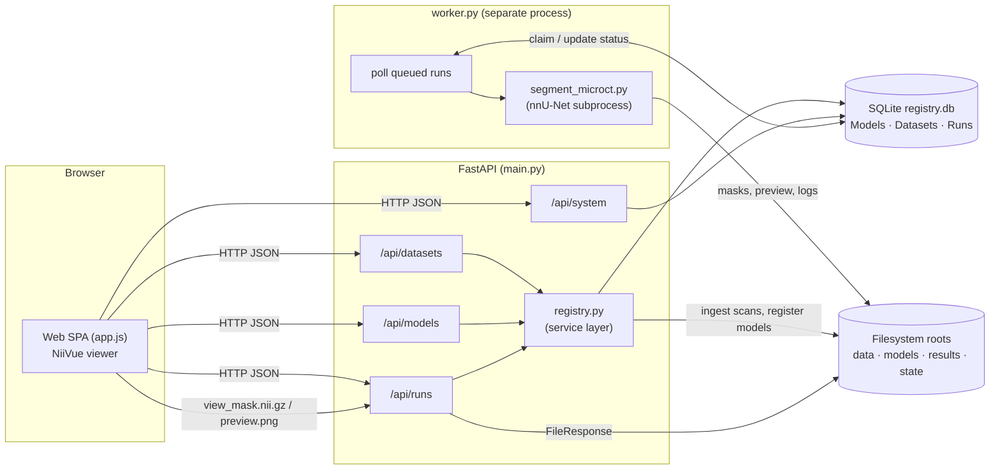
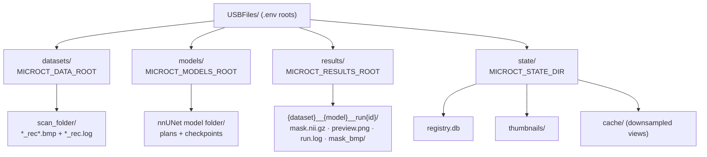
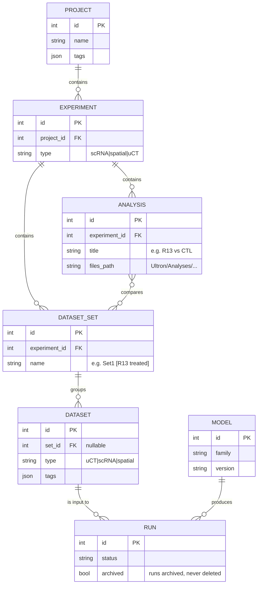
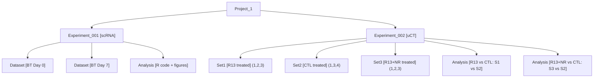

# microCT Segmentation Lab — Data Model & Organization

A visual reference for how **Models**, **Datasets**, and **Runs** relate, how a run
moves through its lifecycle, and how the pieces sit on disk. Diagrams reflect the
**current** schema in `src/microct_lab/models.py`. A final section sketches the
**proposed** Project/Experiment hierarchy from the planned edits.

---

## 1. Entity relationships (current)

Three core tables. A **Run** ties one **Dataset** to one **Model** and records the
result plus a full hardware/environment debrief.

**Key points**

- **Model versioning is half-built already:** `family` groups revisions, `version`
  labels them (`v1`, `v2`), and `fingerprint` (a hash of the weights) lets the same
  model bits be recognized across re-registration.
- Each Run stores an **immutable `model_snapshot`** so results stay traceable to the
  exact model + version even if the Model row is later edited.
- `Dataset.study` and `Dataset.tags` are the only current grouping mechanisms — flat,
  not a real hierarchy (this is what the proposed Projects layer replaces).
- Deleting a Dataset **cascades** to its Runs (`cascade="all, delete-orphan"`).

---

## 2. Run lifecycle (state machine)

The worker polls the DB, claims the oldest `queued` run, executes it, and writes a
terminal status. A cancel request flips a running job to `canceling`; the worker
kills the subprocess within a couple of seconds.

---

## 3. System architecture (request → result)

- The **web server** and the **worker** are independent processes that coordinate
  only through the SQLite DB — no Redis/broker.
- Large microCT volumes are **downsampled** server-side (`view_*.nii.gz`) before the
  browser loads them into WebGL.

---

## 4. On-disk / storage layout

Everything data-related lives **outside the git repo**, configured via `.env`
(`config.py`). Paths shown are the current Windows values.

- **Ingest** walks `MICROCT_DATA_ROOT` for `*_rec.log` files → creates Dataset rows.
- **Run outputs** are named `{dataset}__{model}__run{id}` under the results root.
- The **registry DB + thumbnails + view cache** live under the state dir.

---

## 5. Proposed hierarchy (planned edits — not yet built)

The requested Project → Experiment → Set → File model, with Analysis nodes and
mixed dataset types (µCT, scRNA, spatial). Shown here so the target is concrete.

> **Note:** This section is the design target for the Projects/Experiments work
> (Tier 3). The exact tables should be finalized before implementation, since a
> wrong hierarchy is expensive to undo.
