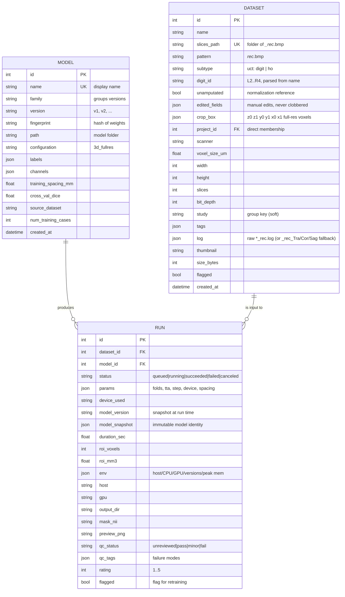
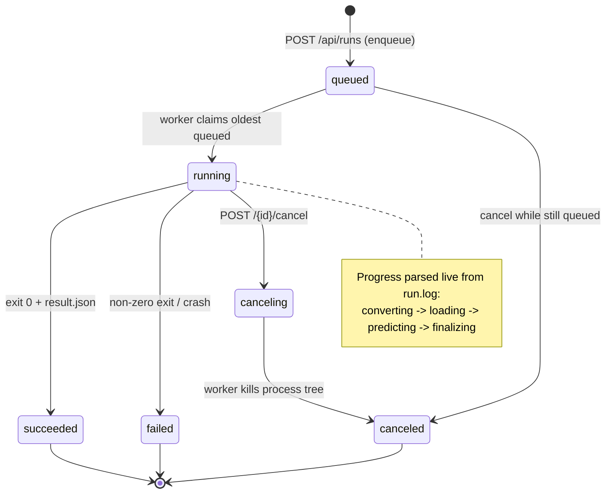
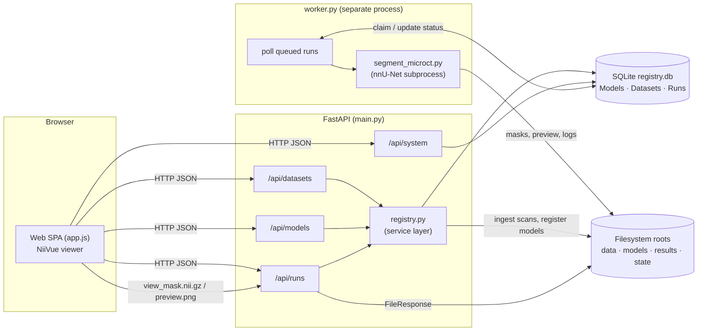
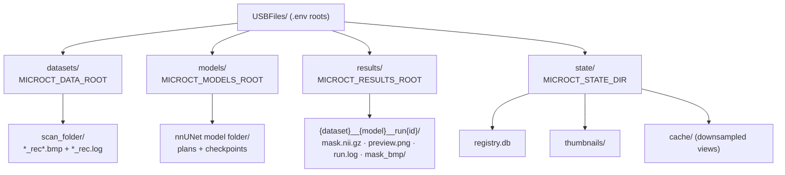
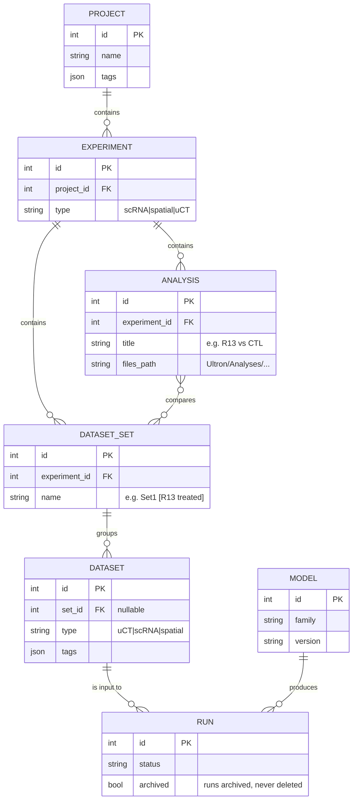
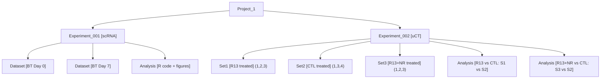

# microCT Segmentation Lab — Data Model & Organization

A visual reference for how **Models**, **Datasets**, and **Runs** relate, how a run
moves through its lifecycle, and how the pieces sit on disk. Diagrams reflect the
**current** schema in `src/microct_lab/models.py`. A final section sketches the
**proposed** Project/Experiment hierarchy from the planned edits.

---

## 1. Entity relationships (current)

Three core tables. A **Run** ties one **Dataset** to one **Model** and records the
result plus a full hardware/environment debrief.

**Key points**

- **Model versioning is half-built already:** `family` groups revisions, `version`
  labels them (`v1`, `v2`), and `fingerprint` (a hash of the weights) lets the same
  model bits be recognized across re-registration.
- Each Run stores an **immutable `model_snapshot`** so results stay traceable to the
  exact model + version even if the Model row is later edited.
- `Dataset.study` and `Dataset.tags` are the only current grouping mechanisms — flat,
  not a real hierarchy (this is what the proposed Projects layer replaces).
- Deleting a Dataset **cascades** to its Runs (`cascade="all, delete-orphan"`).

---

## 2. Run lifecycle (state machine)

The worker polls the DB, claims the oldest `queued` run, executes it, and writes a
terminal status. A cancel request flips a running job to `canceling`; the worker
kills the subprocess within a couple of seconds.

---

## 3. System architecture (request → result)

- The **web server** and the **worker** are independent processes that coordinate
  only through the SQLite DB — no Redis/broker.
- Large microCT volumes are **downsampled** server-side (`view_*.nii.gz`) before the
  browser loads them into WebGL.

---

## 4. On-disk / storage layout

Everything data-related lives **outside the git repo**, configured via `.env`
(`config.py`). Paths shown are the current Windows values.

- **Ingest** walks `MICROCT_DATA_ROOT` for `*_rec.log` files → creates Dataset rows.
- **Run outputs** are named `{dataset}__{model}__run{id}` under the results root.
- The **registry DB + thumbnails + view cache** live under the state dir.

---

## 5. Project hierarchy (implemented on branch `feature/projects-and-ux`)

The requested Project → Experiment → Set → Dataset model, with Analysis nodes and
mixed dataset types (µCT, scRNA, spatial). These tables now exist in
`models.py` (`Project`, `Experiment`, `DatasetSet`, `Analysis`); `Dataset` gained
`type`, `organism`, `set_id`, `experiment_id`, `nas_relpath`, `archived`; `Run` and
`Model` gained `archived`.

> **Note:** All hierarchy FKs are nullable — an ingested dataset starts
> unassigned and is organized into a set/experiment later. Datasets and runs are
> never destroyed by deleting a project, experiment, or set: those operations only
> unlink (null the FK). Runs can be archived but never deleted.

---

## 6. Additions from the Linux-review build (2026-08-26)

- **Dataset category**: `Dataset.subtype` distinguishes **uct digit** from
  **uct ho**. The digit-morphometry gate now keys on it (legacy `phalanx` tag
  still honored; `init_db` backfills subtype from that tag). `digit_id`
  (L2..R4) is parsed from the name at ingest (`registry.parse_digit_id`) and
  `mouse_key()` groups same-animal scans by the name minus the digit token.
- **Independent hierarchy**: `Dataset.project_id` exists alongside
  `experiment_id`/`set_id`. Assigning a set fills experiment+project;
  assigning an experiment fills project; clears cascade downward only.
- **Set details**: `DatasetSet.organism/subtype` autofill members on
  assignment and can be propagated on set edit — `all` or `unedited`
  (skipping any field in `Dataset.edited_fields`, the manual-edit memory that
  re-ingest also respects).
- **app_settings**: tiny key/value table for runtime settings shared by the
  server and worker processes (`parallel_gpu_runs`, `bvtv_threshold_hu`).
- **Parallel worker**: up to `parallel_gpu_runs` segmentation subprocesses at
  once, each pinned via `CUDA_VISIBLE_DEVICES` (slot -> GPU); measurements run
  in their own thread. Limit re-read every loop, clamped to detected GPUs.
- **Interim BV/TV**: `Measurement` rows with `pipeline_version=bvtv_thresh_v1`
  are executed by `scripts/measure_bvtv.py` (threshold within the mask). The
  HU threshold is converted per scan through the `_rec.log` CS window
  (`bvtv.py`); the whole conversion is frozen into `Measurement.params`.
- **Normalization analyses**: `Analysis.data` stores the computed
  normalized-BV/TV table (`type=bvtv_normalization`).
- **Crop**: `Dataset.crop_box` is applied before inference (snapshotted into
  `Run.params.crop_box` at enqueue); `POST /runs/{id}/crop` retro-crops a
  finished mask (original path kept in `params.mask_nii_original`). BMP
  export has two modes: `mask` and `masked_image` (original pixels inside the
  mask, black elsewhere), in separate folders.
